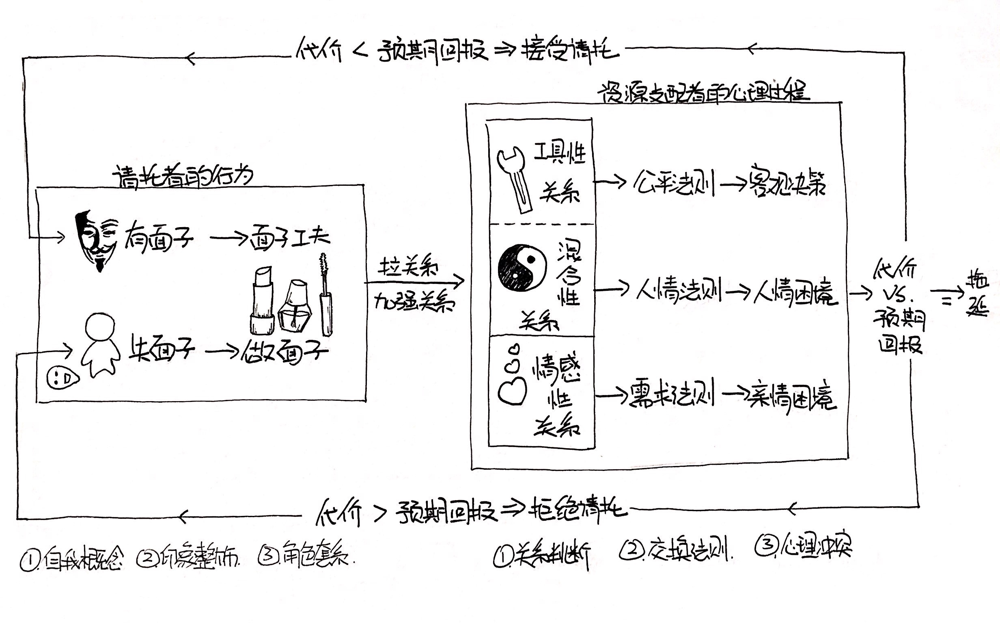

# 从「人情与面子」看借钱

大约一年前一位看过我资产负债表的前辈语重心长的教导我，你的借款太多了，要学会装穷。当时心想有钱人还真是不近人情呢，结果才过了一年就被啪啪打脸。这里的人情不是人的情感，而是作为一种为人处世的社会规范和可馈赠的资源，我大天朝是极讲人情的国度，只要还在使用汉语就一定会受人情的影响，但大部分人并没有深度思考过人情是如何影响自己的。 黄光国老先生的《人情与面子》就是这样一本书，严格讲是本论文合集，黄老先生建立了“人情与面子”理论模式，借这个模式我们来理性的聊一聊借钱这件事。

当有人来找你借钱，那么来借钱的就是“请托者”，而你就是“资源支配者”，在决定借或者不借甚至拖延不决之前，你首先会判断对方和你是什么关系？如果是家人、密友就是情感性关系，采用需求法则，既然对方需要而你又刚好有钱那当然是慷慨解囊，但刚好不方便就会陷入亲情困境，这里暂不讨论；如果对方是朋友或同学，就复杂了，每个人工具性关系和混合性关系之间的界限都不同，取决于你对情感和工具关系的界定以及如何看待这段关系，假如你判断和对方是工具性关系，那就会采用公平法则，盘点一下金额、对方会不会归还、以及中间产生的利息等等，最后决定是否出借。最复杂的就是混合性关系，按照人情法则，你要选择是不是顾及“人情”、“面子”以及对方可能的“回报”来做决定。

假如你做出了借钱的决定，但是对方逾期未还，那么我们再从催债这一角度来看看会发生什么。此时你成功转换为“请托者”，而对方就变成“资源支配者”，主动权发生转移。对方会根据和你的关系来决定采用什么法则处理这件事，如果是工具性关系，那么可采用提高利率、增长借款期或是向第三方借钱等方式来解决；但混合关系和情感关系就有些尴尬了，只要催债这件事发生就会更加损伤情感，这也是很多债权人宁愿自己委屈也不愿出面要钱的原因。不管是什么关系，欠债一方会衡量自己还钱需要付出的代价和预期回报来决定自己是否会还钱，还钱可以获得的回报包括和债权人的情感、自己的信誉、共同关系网中的地位等等。

那么此时作为苦逼的债权人，你该如何催债促使对方还钱呢？从上面的讨论我们知道只有两种可能会促使对方还钱，第一是还钱需要付出的代价小于预期回报，第二是不还钱需要付出的代价大于预期回报。那么作为债权人可以采取下面的措施：
* 减少还钱需要付出的代价：提供分期付款的方式，能收到多少收多少，降低对方还款的难度；
* 提高还钱的预期回报：减免对方需要付出的利息；提高自己的社会地位和可分配资源，这样对方可能顾及以后的长期合作而不愿损伤自己的信誉；
* 提高不还钱需要付出的代价：把对方欠钱不还的事情公之于众，借助共同关系网的力量逼迫对方还钱，只要对方还会在此关系网中长期生存就一定会有所顾忌；以情感关系完全破裂、借助法律手段等威胁对方

这里我们可以得出结论，莎士比亚说「不要把钱借给别人，借出去会使你人财两空」是有道理的。一旦借出，不管对方是否还钱，借钱方都需要承担一段时间的风险。而假如对方不还，借钱方就从资源分配者变成了请托者，从主动转为被动，最后不管是否要回金钱，都有极大可能造成情感破裂、威严损失、自我尊严受挫等。可在现实生活中，我们还是无法避免亲人朋友同学有困难，完全袖手旁观有违道德有伤面子，又该如何应对呢？我看到过一个比较好的办法是在自己能够忍受的金额范围内，送给对方一笔钱，即解决了对方的燃眉之急，又避免了之后一系列麻烦。

最后用一件亲身经历的价值6万的教训结束本文。两年前我借给某人10万元，之后收回4万，剩下6万杳无音信。从这个模式来看，借钱的时候彼此是“情感关系”，我用“需求法则”判断需要付出的代价（应该能拿回的10万）< 预期收益（两人的情感关系），于是作出了借钱的决定（现在看来是多么愚蠢的决定）。但之后关系破裂，前几月由于需要用钱，于是踏上“催债”的漫漫征途，整个过程极其恶心暂不详述，总之对方各种无赖和推脱。这段时间在思考两件事，第一，对方并非完全走投无路，为何欠钱不还？第二，钱干脆不要算了，劳心劳力，但自己又极不甘心。从“人情与面子”模式我找到了两个问题的解答。首先，对方为何欠钱不还？在催债阶段，对方已经由请托者变成了资源支配者，而我们的关系此时已变成完全的“工具性关系”，那么当还钱需要付出的代价大于预期收益时自然会作出不还的决定。那么我有没有办法拿回这笔钱呢？还是有的，按照上面的分析我可以采用的策略有：
* 分期付款，拿回多少是多少？但这意味着我需要继续和他保持联系，这不是我想要的，删除；
* 减免利息？本来就没打算要利息，能拿回本金就不错了，删除；
* 提高自己的社会地位和可分配资源？算了吧，不想有任何接触更别提之后的可能的资源交换，删除；
* 借助共同关系网的情感力量、以法律手段迫使对方还钱？嗯，这条路似乎可行，但是，首先我们共同的关系网比较少，更重要的是，这些途径都需要我付出更多的时间和精力，更无法忍受的是还是需要保持联系，这段已经腐坏的关系会继续在我的生活中发霉长虫，光是想想就浑身难受。
这样一圈分析下来，之前的不甘心完全消散，重新从被动状态转换到主动状态，代价是6万块，预期收益是节省下来的大段时间精力以及为人处世的经验。如此看来，好像还是赚到了耶！

知识改变命运？哦不是，知识改变心情～ 理性死宅也极有可能在现实生活中更幸福。