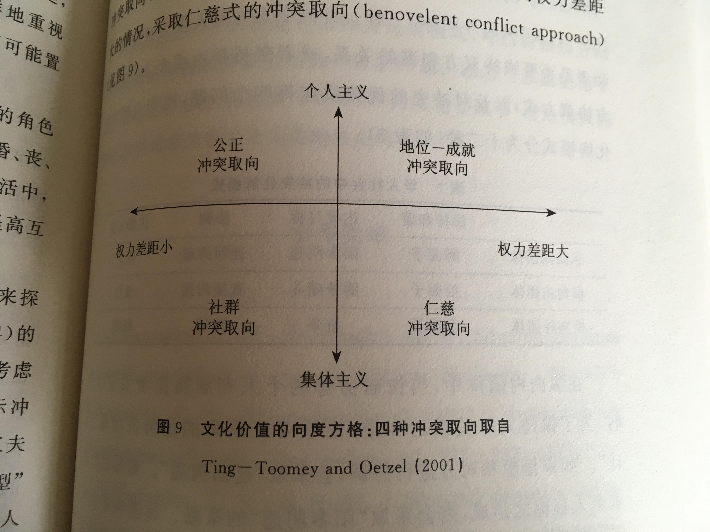
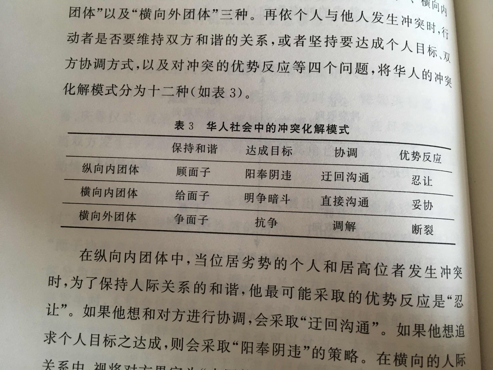

# 技巧卡

## 知识论策略
本书作者在最后一章证明“人情与面子”理论模型是普世性的理论模式，并给出一种有参考意义的发展知识论策略。首先，给出自己的理论模型，再对以往的学者构建出的理论模型进行批判性的回顾，最后用这个理论模型解释这个领域最有权威影响最深远的文化或场景。

## 跨文化取向的限制
心理学有一种研究方法是将不同文化差异某几个维度拿出来之后对某些现象进行分析，这种方法常用来作为跨文化取向的研究，但本书作者指出，这种研究方法有很大局限性，并且构成一种偏见的来源。仅仅通过不同的文化差异研究心理学，不能够很好的处理一种文化复杂的细节，因此本土心理学的研究才更有价值。

书中有一个关于冲突化解模式的研究案例。“面子磋商理论”是依据中西方在“集体／个人主义”、“权力差距”两个向度作出的冲突取向：

而黄光国整合了面子协商理论和儒家关系主义产生一种更能代表华人处理冲突的模式：

来源：《人情与面子》2010版P111-117