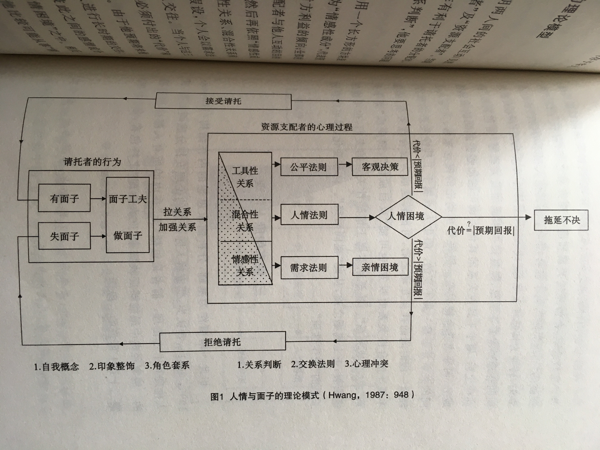
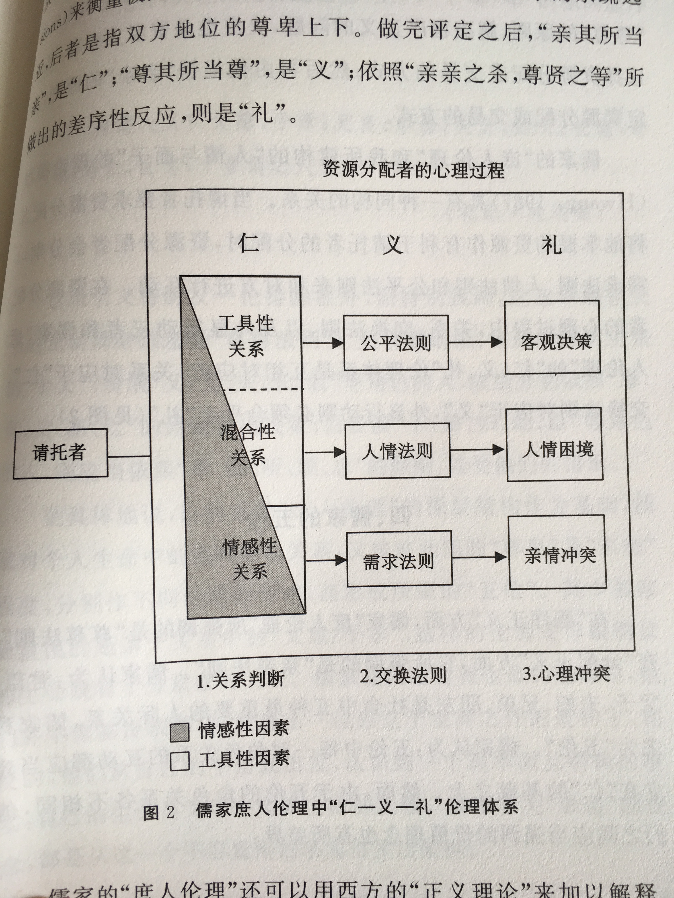

# 术语卡

## 脸&面
* 印象：脸和社会道德、个人品格相关，而面子更多和阶层地位挂钩。丢脸表示社会对其品格失去信息，而面子可增可减，但同时脸和面的概念又有重叠的关系。中国人的政权和日常生活的方方面面都离不开脸面。
* 例子：
	* “脸”和“面”这两个字中，后者较前者远为古老，在古代文献中已经可以发现。早在公元前4世纪，“面”便有指涉自我与社会间之关系的象征性意义；“脸”则是比较现代的名词。《康熙字典》引用的最早典故出自元代(1206-1368年)。这个字似乎起源自中国北部，而后在身体的意义上逐渐取代了“面”，而获得了某些象征性意义。同时，“面”加上无意义的虚字“子”，又发展出各种不同的意义。如今这两个字在中国北部和中部都通用，不过“脸”在长江中部各省的使用不如他在北方的范围广。——《人情与面子》2010版P46
	* 在讨论个人对“没有脸”和“没有面子”两种说法的不同反应时，已经可以看出，“脸”和“面子”是截然不同的概念。前者是最严重的侮辱，它涉及个人道德品格的完整性。后者则只是表示自我无法出人头地并获得声望而已。——《人情与面子》2010版P66
* 出处：胡先缙——《中国人的面子观》

## “人情与面子”理论模型
* “人情”、“面子”、“关系”、“报”这几个概念和中国人的人际关系密切相关，作者以社会交易理论为基础，发展出一套理论架构来计时这些概念之间的动力关系。作者认为这个理论不仅描绘出中国社会中社会行为的原型，同时也可以作为解释大多数文化中社会互动过程的一般性模式，尤其适用于“集体主义”的文化。——P2
* 
* 该模型将人与人的关系分为“工具性”、“混合性”、“情感性”三类，当接收到对方请求时，人们首先会进行关系判断，然后依照关系类型以不同的判断法则衡量如何与之交往，工具性对应公平法则；混合性对应人情法则；情感性对应需求法则。并在作出具体行动前会对自己要付出的“代价”和可能取得的“回报”进行比较而计算出“后果”。 由于混合性和情感性中需要考虑感情因素，有时会陷入人情困境或亲情困境，而对于关系性的评判则更加理性。值得注意的是，三种关系类型划分并不是一成不变的，会随着交往的过程进行变迁。
* 出处：《人情与面子》2010版P240

## 庶人伦理
> 仁者，人也；亲亲为大。义者，宜也；尊贤为大。亲亲之杀，尊贤之等，礼之所由生也。

* 
* 儒家作为影响中华文化最深的思想，作者将“人情与面子”理论模型与儒家思想“仁义礼”进行比对。个人在与其他人进行交往时，依据“亲疏”和“尊卑”两个向度衡量彼此关系，这是儒家的“仁”，依照双方关系的亲疏选择对应的交换法则是“义”，而考虑双方得失利害之后作出恰当的反应则是儒家的“礼”。
* 出处：《人情与面子》2010版P242

## 西方VS儒家道德观
* 西方伦理学中用“消极／积极义务”以及“完全／不完全义务”规范伦理。“消极义务”和“完全义务”要求人不做某些行为，具有强制性；而“积极义务”和“不完全义务”是指引人们行动的格律，但不会说出具体的行动。违反“完全义务”被认为是一种罪恶，而未实践“不完全义务”只是缺乏美德而已。
* 例子：本书中作者以西方伦理观来看待儒家的伦理：

|儒家伦理|Gert之行动观|Kant之理性观|本文之情感观|
|---|---|---|---|
|银律——“己所不欲勿施于人”|消极义务|不完全义务|消极义务（完全义务）|
|庶人伦理（孝道）|积极义务|不完全义务|无条件的积极义务|
|士之伦理（忠）|积极义务|不完全义务|积极义务（不完全义务）|
* 出处：《人情与面子》2010版P85-87

## 人情与人情法则
* 人情有三种含义：
	* 个人遭遇到各种不同生活情景时，可能产生的情绪反应。
	* 人与人进行社会交易时，可以用来馈赠对方的一种资源。
	* 中国社会中人与人应该如何相处的社会规范。
* 人情法则：由于关系网内的人彼此都会预期将来他们还会继续交往，而且因为不管在任何文化中，以均等法则分配资源一向都是避免人际冲突的重要方法。如果有关系的两个或两个以上的人在一起做一件事情，不论每个人在完成这件工作时投入多少，资源支配者为了维持团体的和谐及团体成员之间的感情，他往往会依照均等法则，将工作所得的成果在工作者之间做均等的分配。——《人情与面子》2010版P14