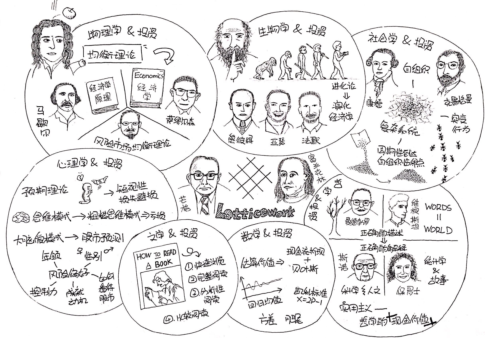

# 智慧的人如何思考

近年来，查理·芒格已不再是“站在股神巴菲特背后的巨人”，他的名字早已为公众所熟知，作为伯克希尔-哈撒韦公司的副主席，他是全球最伟大的投资人也是最有智慧的人，芒格多年来一直主张多元思维模型，他称之为“格栅思维模型”，他强调要了解尽可能多的学科，并把这些学科知识贯穿在一个思维模型中，获得“普世智慧”。

为什么使用“格栅”这个隐喻？本书作者用自己在观察花园的篱笆时的灵光一闪给了一个便于理解的解释，每块格栅就是一个知识领域，两个格栅之间的连接时学科之间的交叉部分，当需要做一个市场趋势判断活着投资决定时，作者会将不确定因素排列，想象它们是一串小灯泡，从每个格栅望过去，如果每个格栅都能看到亮着的小灯泡，那么一开始不确定的想法就可以被验证。

如果你还是对多元思维为什么能够获得“普世智慧”有疑虑，也许学术界爱德华·桑代克的学习理论能够说服你。桑代克1901年出版的研究论文这样说：「在一个领域的学习不会对另一个领域的学习提供帮助，只有在原来的领域和新领域存在相似要素时，学习才能传递。」也就是说，并不是学习知识越多，学习能力越强，但是如果能够发现新旧知识中相同的知识结构，我们就能大幅提升学习能力，因为我们会变的善于识别各种模式。学习的过程会影响神经元之间的突触联结，当识别出相似模式后，大脑会把相关的联结串成环，从而转移到新环境中，正是这种强大的联结能力让人类的智力水平远远超过电脑。在当今人工智能飞速发展的时代，我们不仅要把自己变成终身学习者，更重要的是掌握如何更聪明的学习，格栅模型就是答案。

道理都懂，但是学习尽可能多的学科？这听起来似乎不可思议，古人都说“吾生也有涯，而知也无涯。以有涯随无涯，殆已！”，万幸的是我们并不需要精通所有学科，只需要了解这些学科中最重要最源头的思想，掌握并使用它们，要知道知识领域也遵循二八法则，20%的知识足以解决80%的问题。

本书作者罗伯特·哈格斯特朗，正是受芒格的思想启发，写了这本书，全书有九个章节，第一个章节作者讨论了格栅思维，第二至八章节作者分别从物理学、生物学、社会学、心理学、哲学、文学和数学七个学科回顾历史，从那些重要而基本的概念着手，探讨它们如何与投资、市场相关联。最后一章决策过程，作者讲述了人类在复杂系统中决策的认知限制，并再次赞美格栅模型。

当然，一本两百多页的书不可能把所有的学科精华都阐述清楚，从学术角度来看，本书涉及到的每一学科的概念和思想都比较浅显，但作者正是借着这些简单易懂的概念，向我们展示如何提取各个学科中最基本的模型，获得20%的知识，并把它们纳入自己的“格栅思维模型”。另外本书还提供了大量的参考书目，以便有意对某学科进行深入研究的读者进一步探索。

下面就让我们跟着作者一起回顾这些领域，看看它们和投资有什么关系，又能给我们什么启示。

### 物理学
牛顿大家都很熟悉，他被一颗苹果砸中，灵感突发然后发现万有引力的故事为人们所传颂，且不管这个故事是否真实，万有引力的发现让物理学完成一次巨大的飞跃，但牛顿直到20年后才出版《数学原理》用数学精确的证明了他的发现，并提出三大运动定理，他证明行星之所以围绕地球转动，是因为受到向心力与太阳对他的引力，这一对力产生了一种均衡。牛顿的《数学原理》发表后，科学界普遍接受了这一理论，从超自然的上帝控制转而思考宇宙规则，于是其他很多学科也从“均衡”发展新思想。

均衡思想对经济领域有什么影响呢？作者列举了200多年间三位通过均衡理论解释经济学的经济学家：《经济学原理》的作者阿尔弗雷德·马歇尔、1970年诺贝尔经济学获得者保罗·萨缪尔森以及因为提出“风险之下的资产价格市场均衡理论”而获得诺贝尔经济学奖的威廉·夏普。在均衡理论的基础上，人们普遍认为市场是有效的，股价能够反映股票的所有真实信息。

但随着经济学的发展，越来越多的人意识到，市场是非理性，也并非完全有效，否则难以解释牛市或股灾的存在，也不会有股价剧烈的波动。这不是说均衡理论错了，而是除了均衡理论外还有其他元素在影响市场供需、价格和价值之间的平衡关系。这就是下一章的生物学。

### 生物学
生物学中最重要的发现大家都很熟悉——达尔文的进化论。1959年，达尔文出版《自然选择之下的物种起源，生存斗争之中的优势种群》一书，简称《物种起源》，这本书出版当天就被销售一空，进化理论也成为19世纪最具争议的话题之一，然而其中的大部分观点今天已经被大家广泛接受，进化论打击了人类自尊心，让人们意识到自己并不是万物之灵，却带来一场知识革命，改变了其他领域的很多看法，包括经济学。

最早关注进化理论的经济学家是上面提到的马歇尔，他的《经济学原理》首页有一段拉丁短语“自然从不飞跃”，而这句话也同样出现在《物种起源》中。《经济学原理》出版后的20年，约瑟夫·熊彼得出版《经济理论的本质》，他提出经济学本质上是在不断进化的观点。然而在当时这个理论并没有得到广泛支持，直到几十年后，圣达菲研究所中一批经济学家开始摆脱经典经济学，重新审视现实经济世界中的不均衡现象，大家逐渐意识到经济和股市是一个复杂的适应性系统。复杂适应性系统是指一个系统中都有很多独立个体单元在同一平台上互动，每个个体单元都会更具互动的反馈结果来调整自己的行为，不断适应环境。类似的例子还有：蚂蚁群、中枢神经系统、政治体系、社会结构等等。原本是物理学家的多因·法默在圣达菲研究所一篇名为“市场作用力、生态学和进化”的文章中，对物种互动的生物生态学和策略互动的金融生态学进行类比，他是第一个从全新的角度用激进的方式重新定义经济系统如何表现的科学家。

300年后，人们从牛顿的平衡世界进入到达尔文的进化世界，生物学带领我们完成新旧科学的交替。

### 社会学
前面提到过经济和社会机构同样都是复杂的适应性系统，那么社会学作为一门研究人类在社会中如何行动的学科，就可以提供更多的思考角度。

复杂适应性系统有两个特征，第一个是自组织；第二个是突变现象。“自组织”这个词首先出现在伊曼努尔·康德的《判断力批判》。是指没有绝对权威和其他预先计划的因素下，一个系统结构的形成过程。书中介绍了2008年诺贝尔经济学家克鲁格曼一个解释自组织的例子：洛杉矶的每个商圈都不是城市规划者设计出来的，而是各种种族、社会经济体自己聚集之后的自发过程。而突变现象是指个体单元聚集在一起，创造出超过所有个体总和的方法，理解这个概念的最佳例子是蚁群捕食，蚂蚁寻找食物时，会在身后留下味诱激素引导其他蚂蚁，而若某个蚂蚁发现了更短的路线，它就会在新的路径上留下更浓的激素，不断循环直到蚁群找到了一条最短路径。这种集体最优的解决方案就是群体的突变特质。专栏作家索罗维基说，只要有多样性和独立性两个最重要的元素存在，集体就能大于个体综合，产生最优秀的决策。

理解了复杂适应性系统的这两个特点就可以更好的理解股市。当股市中的每个个体都是独立的，且拥有足够的多样性时，股市可能确实是有效的，但在现实中，人们并不总是理性独立的，大量研究证明人类有从众心理，而一旦从众人数增多达到某个临界值，系统的多样性就会消失，消失了多样性的系统就像一个不稳定的沙堆一样，形状开始变得陡峭，直到发生雪崩现象。

作者认为复杂的社会系统与自然系统有很多类似，但其中最大的不同就是社会系统中，我们可以通过改变个体的行为，从而避免可能出现的雪崩现象。如何避免？可以从下一章心理学找到答案。

### 心理学
这一章作者从心理学角度解释人们为什么喜欢追涨杀跌？为什么喜欢预测股市？风险偏好到底由什么决定？以及如何获得好的思维模式。下面我们一一道来。

《思考，快与慢》的作者丹尼尔·卡尼曼大家都很熟悉，他在1979年与数学心理学家阿莫斯·特沃斯基一起写了一篇名为“预期理论：风险条件下的决策分析” 的论文。当时学者普遍认为个体会在风险环境中根据如何获得利益最大化来做出选择，而卡尼曼和特沃斯基用数据证明个体承受损失时的痛苦差不多是获得等量财富时快乐的2-2.5倍，因此个体是厌恶风险的，在风险环境下会做出规避风险的选择。

芝加哥大学商学院的行为学和经济学教授理查德·泰勒与加州大学洛杉矶分校安德森管理学院的教授什洛莫·贝纳滋于1995年发表“用短视性风险规避模型解释股票溢价之谜”。这篇文章将预期理论中的损失趋避提取出来，与股市联系起来。他们发现损失趋避和频繁查看价格让投资者不愿承担股票风险，阻止投资者长期获利。他们创造了「短视性损失趋避」这个词汇，用于指代损失趋避和衡量投资的频率。

这个发现完美解释人们为什么会频繁查看股票价格，并且明知道经济会在长周期增长的情况下迫不及待卖出浮亏的股票。而巴菲特就是一个避免了短视性损失趋避的人，在他持有可口可乐公司股票的10年间，6年表现良好，4年表现糟糕，如果计算损失趋避函数：6-2*4=-2，是负值。所以想要像巴菲特一样在股市中获得巨大收益，就要学会如何避免短视性损失趋避。当然，第一步必须意识到人类存在这个弱点，然后可以通过刻意减少查看股价的频率等行动远离这个弱点。

人们为什么喜欢预测股市呢？这和人类大脑进化有关，人类是因果思维的生物，为了生存我们必须从生活中获得一种模式来面对未来不确定的世界。而股市是在现代文明社会才出现的物种，我们之前了解过股市是一个复杂的适应性系统，在这样的复杂系统中很难通过简单的归因找到趋势，但大脑不这样认为，大脑喜欢找模式的特点会督促我们对未来作出预期，因此，即使人们知道股市是无法预测的还是忍不住去猜测。

那么人们的风险偏好又有什么决定呢？证券公司通常会通过问卷调查投资者的风险偏好，问题设计是通过情景假设，让投资着做出风险偏好的选择。但这种检测并不准确，著名的社会心理学家迪安G.普鲁伊特认为，投资者的行为可以被称为“沃尔特·米蒂效应”，当在牛市中时，人们会变得勇敢，渴望承担更多的风险，而在熊市中，人们会变的唯唯诺诺。更加精准的计算风险容忍度依赖的元素有：年龄、性别、个人控制力、成就动机、如何看待风险环境。也就是手，假如年龄性别相同，那些认为自己有强大控制力、有明确的目标以及认为所获的的回报取决于个人技能的人拥有较高的风险容忍度。不妨根据这个模型思考一下自己的风险偏好？

在本章的最后，作者用数学家香农的信息噪声修正装置给大家提供一种独立判断信息的建议。香农认为信息传递中一定会产生相当程度的噪音，我们需要在接收器和目的地中放置一种修正装置，用来去除噪声，获得真实的信息。查理·芒格这样建立自己的“修正装置”：在他作出投资决策前，他会思考“第一点，真正控制利益的因素有哪些，我是否理性地思考过？第二点，什么是自动控制这些食物的潜意识的影响——潜意识影响很有用，但常常会出现故障。”。芒格的修正装置可以给我们做参考，不过我们也许可以从下一章哲学领域中获得更多启示。

### 哲学
哲学似乎总是研究一些形而上学的脱离实际的概念，它和投资有什么关系呢？波士顿大学教授麦金太尔认为，哲学是理解复杂系统的重要方法，任何关于复杂系统的研究都含有哲学原理。

得到app中财富自由专栏的作者李笑来老师特别强调概念的重要性，他认为人们无法作出好的选择是因为概念不清，实际上历史上有很多哲学家也有相同的主张。“错误的解释源于错误的描述！”贝努瓦·曼徳勃罗曾这样说，他对自然的认识和大多数人有所不同，于是创建了分型几何学，并运用到物理学、生物学和金融学。奥地利哲学家维根斯坦也持有类似的观点，他认为人类所见的世界由人类选择的词语定义并赋予意义，我们怎么看世界，世界就是怎样。词语给现实赋予了意义。作者还列举了“两种文化”的作者C.P.斯诺以及天普大学数学教授约翰·艾伦·保罗士，他们均认为正确的描述对获得正确的解释至关重要。

我们可以从亚马逊股价的例子更好的了解这一观点，亚马逊1997年上市之后股价大涨，很多人将其和沃尔玛以及线下实体书店举行类比，认为亚马逊有很大泡沫，而另一些人认为亚马逊模式更像戴尔公司，判断其股价会继续上涨。从现在来看，孰对孰错非常明了。当年电商模式刚刚兴起，人们对其的错误描述阻碍人们认识到这家公司的实际价值。

那么我们该如何获得正确的描述呢？哲学中的实用主义可以给我们相关的指导，早期哲学思想认为真理是绝对且不可改变的，而实用主义认为思想是用来预测、解决问题和行动的工具，检验思想的方式是行动并根据经验和结果来验证，并且真理会随着环境的变化而改变，这个世界的真理是不断进化的。我们需要不断尝试新事物，学习新思想，用不同的思维模式思考，不断更新自己对世界的描述，只有这样才能获得正确的描述。实用主义的主张和格栅思维模型不谋而合。

### 文学
如果你还是觉得哲学不够接地气，那么文学就提供了切实可行的行动指南。查理·芒格认为，我们必须进行自我教育，把伟大的思想变成自己的财富，而实现方式就是阅读。在这一章作者为我们介绍了圣约翰学院的教学方式以及每位学生都会精读的《如何阅读一本书》，这本书1972年出版，至今还没有任何一本有关阅读的书能够超越它的地位。

这里简单介绍一下本书推荐的阅读过程：
1. 快速浏览：前言、目录、索引、参考文献、系统快读（终点段落，书后总结），半小时到一小时内了解这本书整体上写的是什么，回答“整本书讲了什么内容？”这个问题，判断自己是否需要花时间读；
2. 完整阅读，回答“这本书详细内容是什么？”，集中精力通读全书，跳过困难的章节，寻找是否值得深入阅读的线索；
3. 分析性阅读，回答“这本书是真实的嘛？”，手边放一个笔记本，对每一章的重要话题进行概括；用自己的话写下来认为作者写作这本书的主要目的；列出作者的基本论点，与内容概括举行对比，判断作者是否达到写作目的，捍卫了自己的论点并说服你；作者是否有逻辑，资料来源是否准确；
4. 共鸣阅读、比较阅读，回答“这本书的目的？”，这个阶段需要了解某个特定的主题，对比不同作者的作品：
*  寻找这个主题的所有图书，通过快速审读决定应该阅读哪一本，剔除关联不大的书
* 找出每本书的相关段落，找出每本书的重点内容
* 用自己的语言列出一个问题清单，分析所选书在回答这些问题时的优劣
* 分析各位作者的讨论，公平对待各位作者的不同观点，做出自己的结论，回答：这本书的意义是什么？是不是对你特别重要？是否需要学习更多东西？

书有很多不同类型，我们对不同类型的书也需要采用不同的策略：
* 实用性作品：提供行动建议，只有采取行动后，书中的真理才有用。
* 理论性作品，关注观点，如历史、数学、自然科学、社会科学类图书。
* 哲学作品，首先尽最大努力找到作者视角和隐藏在其思想下的假定；尝试理解用于描述这个问题的术语；用常识和自己对周围世界的观察做出判断。
* 文学类作品，融入想象世界，理解人物和他们之间的关系，分析自己是否喜欢它，以及喜欢或不喜欢的原因。

大家也许认为阅读文学作品不能获得任何有关投资的新见解，其实不然，文学作品能够将复杂的事件进行戏剧性处理，阅读过程中我们会和书中人物拥有共同命运，并从他们的处事方式上学到很多。

### 数学
最后一个领域，数学。数学和投资的关系大概是最容易理解的，实际上，数学中存在很多抽象级别非常高的模型和概念，不仅能够帮我们理解投资市场，更能帮我们更加理性的看待我们的生活。本章中作者选取了概率、方差、均值回归等基本数学概念，给大家一些投资指导，比如：
* 如何衡量一家公司的实际价值？传统的现金流折现也许是最完美的模型，但在实际使用中并不容易，需要计算公司未来成长率、确定公司可能产生多少现金，还必须使用合适的折现比例。但如果能够和贝叶斯推理结合起来，便能够建立自己的投资决策树。
* 用凯利标准指导自己在大周期分配投资组合：x=2p-1，p为成功的概率，x为可用于下注的存款比率。
* 如何在边缘市场获利？边缘市场是指随着时间变换，价格几乎没有发生改变的现象。人们普遍认为边缘市场无法让长期投资者获利，然而事实并不如此，边缘市场是根据均值和中位数来下的定义，然而均值、中位数均是抽象数字，并不能代表现实，现实生活中的事物存在极大的差异。即使是在边缘市场中也能通过对公司实际价值的分析判断那些优质的企业。

以上就是本书作者带领我们畅游在七大学科中的思想精华。这本书的副标题叫做“投资的格栅理论”，然而全书并没有讨论如何选股，更没有投资建议，但却提供了很多很好的思维模式。好的思维模式不仅能够让我们在股市中获得更多保障，更能指导我们如何看待世界和分析问题。

格栅模型如此有用，想要获得智慧的你是不是也跃跃欲试？但仅仅通过阅读一本书还不足以真正把这些学科容纳进自己的格栅思维框架，只有通过自身的学习和研究，亲自提取那些最重要的源头知识，并用这些知识解决过自己的实际问题之后，才能说自己开始建立格栅模型了。本书作者用这本书提供了极好的范例：
1. 掌握每个学科20%的源头知识
2. 从自己需要解决的问题出发，识别学科中存在的相似的模式。

希望大家能够从本书中获得启发，开始建立属于自己的格栅思想模型。

简单的通过作者的罗列不可能真正把这门学科容纳进自己的格栅思维框架，只有通过自身的学习和研究，并用这些模型出发解决过自己的实际问题之后，才能说自己开始建立格栅模型了。但作者却在这本书却提供了极好的范例，

1. 学习每个学科20%的源头知识
2. 从自己需要解决的问题出发，识别学科中存在的相似的模式。

桑代克1901年出版的研究论文能够很好的解释为什么要这样学习，「在一个领域的学习不会对另一个领域的学习提供帮助，只有在原来的领域和新领域存在相似要素时，学习才能传递。」也就是说，并不是学习知识越多，学习能力越强，但是如果能够发现新旧知识中相同的知识结构，我们就能大幅提升学习能力，因为我们会变的善于识别各种模式。学习的过程会影响神经元之间的突触联结，当识别出相似模式后，大脑会把相关的联结串成环，从而转移到新环境中，正是这种强大的联结能力让人类的智力水平远远超过电脑。在当今人工智能飞速发展的时代，我们不仅要把自己变成终身学习者，更重要的是如何更聪明和有用的学习，格栅模型就是答案。

