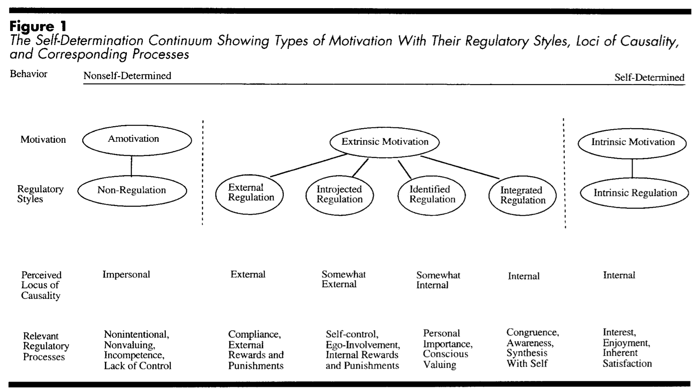

# 叛逃计划

## 倾听大脑的声音
>  人们想做的事以视觉图画的形式存于脑中，仿佛一部自制的生活纪录片，人们真正做的事由脑内的说话声决定，这些说话声是一些内部对话。

我们的大脑存储了太多对话，“爸爸妈妈”说“你应该怎样怎样”，“成人”说“我最好如何如何”，而内心的“儿童”有很多想做的事情却发不出声，偶尔还要出来捣乱。我们要做的首先是聆听这些对话，分清说话者到底是“父母”、“成人”还是“儿童”，认识自己永远都是改变现状的第一步。

分清“父母”、“成人”和“儿童”之后就可以尝试进行头脑内的沟通，让“成人”和“儿童”进行内部对话，对话时暂时把“父母”排除在外，知道他们清晰地理解了彼此之后，“父母”才可以出来说话。

## 沟通分析
> 沟通分析建基于对两个人或多个人所有可能的沟通方式的分析。人们沟通方式的数量是有限的（9种互补沟通，72种交错沟通，6480多复式沟通，36种角沟通），其中大约只有15种在日常生活中最常见。

单单记住这15种沟通方式对普通人意义不大，反而容易陷入知识的诅咒，我们需要做的是找到生活中最困扰的对话场景，分析对话双方当前的心理状态。拿容易引发口角的交错沟通为例，男生以“成人”之间的对话询问女友“我们晚上吃什么？”，女生以“儿童”回应“成人”的方式回答“为什么你总要问我？你不能有点担当吗？！”接着双方无法继续讨论吃什么，开始无厘头的争论。

尝试分析日常生活中典型的对话场景能够帮助我们识别习惯的模式，而这个对话模式是脚本影响最深远又最细微的地方。

## 给予许可
> 真正的许可只包含允许，就好像钓鱼许可证。有钓鱼许可证的孩子并不是必须钓鱼，而是他愿意钓就钓，不愿意钓就不钓。当他想去钓鱼，环境又允许时，就可以去钓鱼。

父母、工作、社会给了我们太多禁令或是强迫，不能做这个不能做那个，必须考上大学必须找到好工作必须挣好多钱…… 但却有太少的许可。作为父母可以多给孩子一些许可，作为成人可以多给自己一些许可，人类都应该有自主选择的许可。

另外一个小tips，尝试用“可以”脚本与自己对话。“这项工作很重要，我可以在完成之后再去休息。”这种指令让自己养成完成工作的好习惯，“这项工作很重要，所以不做完我不可以休息！”这种指令常常导致自我放弃。

## 和优秀的同侪在一起
> 当一个人冲破袋子，开始做自己的事情时，结局指令会决定他将明智行事以成为赢家，还是会过度行事成为输家。
> 
> 但是如果没有外人客观的评价，他很难知道自己是真正被解放的人，还只是愤怒的反叛者，亦或是跳出一个袋子又跳入一个瓶子的精神分裂症患者。

同侪是那些地位、兴趣等和自己相仿的朋友，优秀的同侪压力在倒逼自己成长的同时给予正向及时的反馈，这些成长和反馈是脱离输家脚本成为赢家的力量。

## 降维打击
生活在脚本里就像在莫比乌斯环上跑步，拼命以最大速度向前冲，却不知道，自己已被牢牢困住，用不同的形式重复昨天的模式。想要跳出这个系统，就必须进入更高的维度。

进入更高维度的最佳姿势就是提升认知能力。认知决定如何看待这个世界如何思考如何决策，只有认知能力提升，才能看到以前看不到的局。

## 自我决定论
Self-determination theory（简称SDT）, 由Ryan Richard M.(莱恩)和Deci Edward L.(德西)在20世纪80年代提出的一个有关人类个性和动机的理论，主旨在探讨个人发自内心的动机，排除外在诱因和影响，把重点聚焦在个人激励与自我决定。

SDT被广泛用于个人成长、企业管理、人际关系、心理修复等，这个理论太重要，下面是一些详细介绍，如果觉得理论太枯燥，只需要记住一句话「坚持以内在驱动做事，外在的实物奖励会伤害内在驱动。」

SDT由6个小的理论构成：

* Cognitive Evaluation Theory
    * CET讨论各种环境因素对内在动机的影响：
        * 能够增强内在动机的因素：来自外界的针对能力的正向反馈、有难度的挑战、关于效能提升的反馈、免于遭受贬低的评价（自我的能力感提升会减少这些因素的影响）
        * 当胜任一项任务时并不能提升内在动机，除非自主感和胜任感同时得到满足：自主选择权、能够表达真实感情的自由、自主决定权能够提升自主感，从而增强内在动机
        * 实物奖励、威胁、截止日期、指令、强加的价值和目标会对内在动机造成伤害
    * 以上的因素对内在动机的影响仅仅限于这件事情是新奇的、有挑战的、有美学意义的，也就是说，这件事是由自我驱动来完成的。
* Organismic Integration Theory
    * OIT定义了6种动机类型：缺乏动机、外部（external）动机、融合（introjected）动机、认同（identified）动机、整合（integrated）动机、内在动机 
    * 从左到右，越倾向于内在动机，人们的自主感、掌控感就越强。
    * 人们在不同的阶段会有不同的动机类型，但这并不是一个成长轨迹，并不是说每个人都会经历所有的类型。人们的动机类型取决于之前的人生经验和当下的环境因素。但研究表明，随着认知能力和自我意识的不断提升，人们会越来越倾向于内在动机。
* Causality Orientations Theory
    * 拥有内在动机的人受兴趣本身的驱使
    * 拥有外在动机的人受到奖赏、鼓励、酬劳的驱使
    * 缺乏动机的人受能力缺失带来的焦虑的驱使
* Basic Psychological Needs Theory
    * 人类与生俱来的三个需求，如果满足这三个需求，将会有良好表现，并且能够感受到持续的幸福，反之会出现零碎、反作用、疏离的自我：
        * Competence  胜任感
        * Relatedness 归属感
        * Autonomy 自主、掌控感
* Goal Contents Theory
    * 外部目标（财富、外表、名声等）相对于内部目标（社群感、亲密关系、自我成长等）会给健康和自我表现带来不好的影响
* Relationship Motivation Theory
    * 高质量的人际关系建立在每个人的胜任感、归属感和自主感都得到满足的基础上，所以每个关系中的成员都需要给对方提供相应的支持

--

以上是我目前的叛逃计划，假如我以惊人的毅力完成了所有计划，如何确定自己脱离了既定脚本？还是像Maeve（西部世界的老鸨）一样，其实叛逃这个桥段本身也是脚本编制好的？也许没有人知道，但内在驱动是唯一的希望。

> 不论我是在虚假的弹奏钢琴，还是在用自己的思想和双手弹奏和弦，我的生命之歌同样充满惊喜和悬念，因为它演奏出命运的激动人心和荡气回肠。

Enjoy your life.